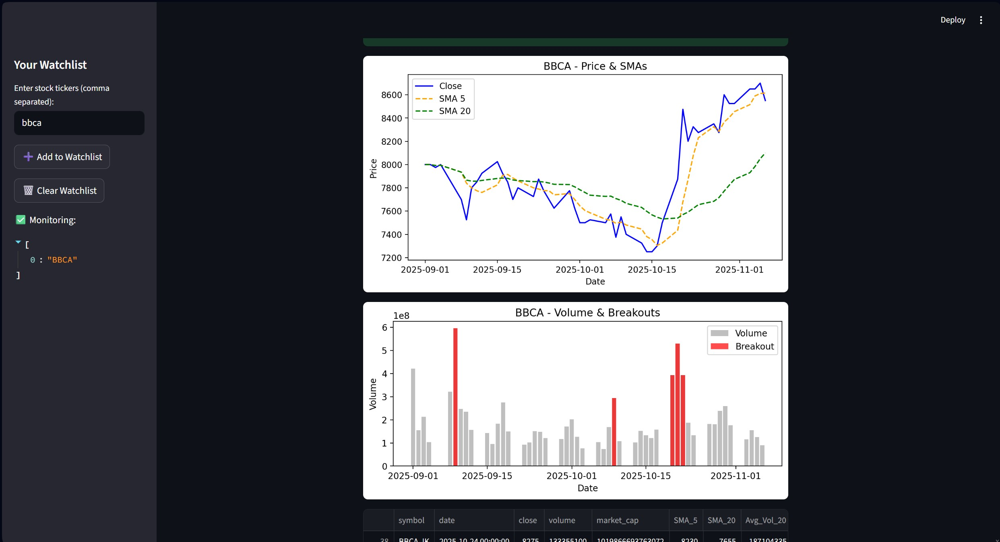
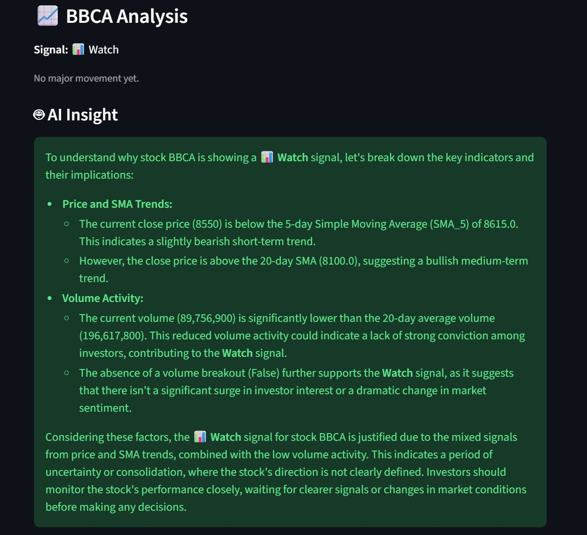
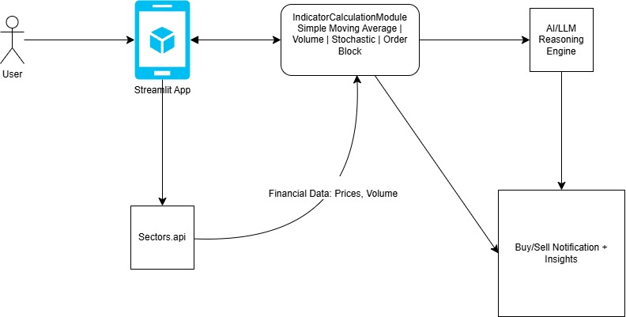

# AI-Powered Financial Investment Assistant 📊

An interactive Streamlit application that helps modern retail investors interpret technical indicators like Simple Moving Averages (SMA), Volume Breakouts, and potential Order Blocks using real-time stock data and LLM-based explanations.

---

## 🧩 Project Overview

Manual stock analysis can be time-consuming and confusing, especially for beginners who must track multiple indicators across many stocks.

This project automates that workflow by:
- Fetching real-time financial data from the Sectors API
- Calculating 5-day and 20-day SMAs and Volume Breakouts
- Highlighting potential bullish/bearish zones (order blocks)
- Using an AI agent to explain signals in simple language (buy / watch / sell)

---
**Simple Moving Average (SMA)**: The simple moving average shows the average price of a stock over a certain number of days. 
- 5-day SMA : Calculates the average closing price over the past 5 trading days. It is used to capture short-term trend of the stocks and enables user's to detect early changes in stock price 
  If the prices goes above the 5-day SMA, it often signals users to buy the stock and give users optimism regarding the increase in the stocks market performance. 
  If the price falls below the 5-day SMA, it often indicates a short term fall in the stock's price. The user can have the choice to buy the stock in its short term current low price or sell the stock. 
- 20-day SMA:  
Calculates the average closing price over the past 20 trading days. This is used to identify the long term trend in the stock. 
  when the 5-day sma crosses above the 20-day sma, it indicates a bullish market crossover and indicates a strong potential buy signal 
  When the 5-day sma crosses below the 20-day sma, it indicates a bearish market crossover and provides a sell signal 

**Volume breakout**: check the volume data of each day and calculate the 20-day average trading volume. 
Check each day, if the current day's volume is 50% higher than the 20-day average volume, mark it as a volume breakout, a breakout indicates a strong market interest in the stock, which can lead to the price movements either going upwards or downwards.

  

AI generates its insight to the user and signals the user based on its analysis.

  

The purpose it to enable users to identify the trend reversals and see the momentum. The AI helps users with providing advice based on the Simple moving average, however it is still the user's choice whether to buy or sell the stocks. A short-term fall in the stock price or a bearish market can also be an opportunity to buy the stock in low price and wait for the stock price to increase. While an increase in the stock's market performance or a bullish market can also indicates the user to sell their stocks in order to gain profit. It is up to the user to make the decision on what to do with the information provided and they don't always have to follow the signals provided by the AI.

## ✨ Key Features

- 📈 **SMA Analysis**  
  - 5-day SMA for short-term trend  
  - 20-day SMA for medium-term trend  

- 📊 **Volume Breakout Detection**  
  - Compares current volume with 20-day average  
  - Flags strong interest periods that may confirm price moves

- 🧠 **AI Financial Assistant**  
  - Uses LLM reasoning to generate human-readable explanations  
  - Interprets SMA trends and volume behavior (no personal financial advice)

- 🖥️ **Interactive Streamlit Dashboard**  
  - Select stock and date range  
  - Visualize price, SMA, and volume in charts  
  - See signal (buy / watch / sell) with explanation

---

## 🏗 Tech Stack

- **Python**
- **Streamlit**
- **Pandas / NumPy**
- **Matplotlib**
- **Sectors API** (for financial data)
- **Groq / LLM** (for AI explanations)

---
---
The workflow:
The diagram below illustrates how data moves from the user input through the Sectors API, 
indicator analysis module, and LLM reasoning engine before producing insights in the Streamlit UI.

  

1. User interacts with the Streamlit app. 

2. App calls the Sectors API to fetch stock price and volume data.

3. The app computes:
    - SMA (Simple Moving Average)
    - Volume Breakout detection
    - Order Block (Bullish/Bearish zone detection)

4. A Lightweight LLM agent (via API or local reasoning function) interprets the signals and provides a natural-language summary.

5. provide the Results and buy/sell indicators are shown in an interactive dashboard.

## Reflection

In this project, I generate an AI agents that works with financial tools, integrated with real-time financial data from the Sectors API and visualizing its result using Matplotlib. I explored how the Simple Moving Average (SMA) and Volume Breakout indicators can help analyze stock performance and support better decision-making for users.

One of the main challenges was adapting the SMA and Volume Breakout formulas to process daily transaction data accurately within the application and implementing the AI explaination module and signal generation feature to provide the system with the  ability to provide clear, beginner-friendly interpretations of market movements to inexperienced users.

## Future Improvements and Patches:
- A user prompt that enables users to explain its use case, his current situation on how they are managing their stocks in order to provide a more accurate buy/watch/sell signals from the AI.

- Create a stochastic oscillator (a momentum indicator that measures the speed and direction of the price movements by comparing stock's current closing price to its price range). This enables detection of stock price moved up too quickly and also potential trend reversals for the user.

- Data Session Persistance: Save the data of user watchlist between sessions

- A real-time monitoring system to constantly keep users updated with the stock analysis and performance.

### References

- Sectors API Documentation

- Investopedia: Technical Indicators: Simple Moving Average

- Investopedia. “Volume Breakout.”

- TradingView Education. “Volume Analysis and Breakouts.”

- Streamlit Documentation

- OpenAI / Groq LLM APIs

- Financial AI Algorithma Week 7: 07-ai-applications-main/tools.py
